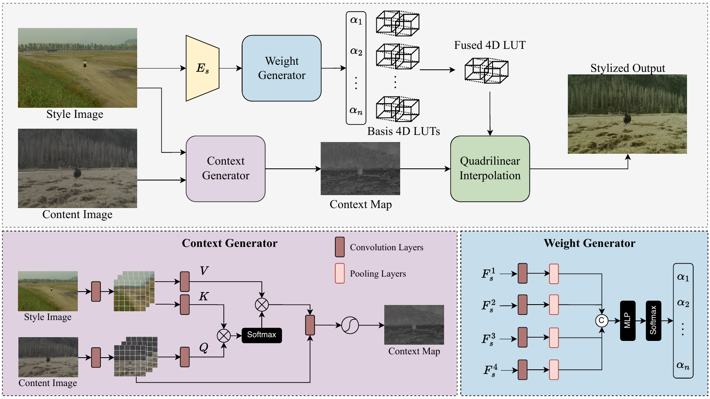

# SA-LUT: Spatial Adaptive 4D Look-Up Table for Photorealistic Style Transfer

🤗 Download the PST50 benchmark dataset on [Hugging Face](https://huggingface.co/datasets/zrgong/PST50)

This repository contains the official implementation of the paper "SA-LUT: Spatial Adaptive 4D Look-Up Table for Photorealistic Style Transfer".

## Abstract

Photorealistic style transfer (PST) enables real-world color grading by adapting reference image colors while preserving content structure. Existing methods mainly follow either approaches: generation-based methods that prioritize stylistic fidelity at the cost of content integrity and efficiency, or global color transformation methods such as LUT, which preserve structure but lack local adaptability. To bridge this gap, we propose **Spatial Adaptive 4D Look-Up Table** (SA-LUT), combining LUT efficiency with neural network adaptability. SA-LUT features: (1) a Style-guided 4D LUT Generator that extracts multi-scale features from the style image to predict a 4D LUT, and (2) a Context Generator using content-style cross-attention to produce a context map. This context map enables spatially-adaptive adjustments, allowing our 4D LUT to apply precise color transformations while preserving structural integrity. To establish a rigorous evaluation framework for photorealistic style transfer, we introduce PST50, the first benchmark specifically designed for PST assessment. Experiments demonstrate that SA-LUT substantially outperforms state-of-the-art methods, achieving a 66.7% reduction in LPIPS score compared to 3D LUT approaches, while maintaining real-time performance at 16 FPS for video stylization.

